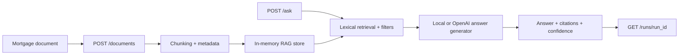

# Mortgage Intelligence Copilot

Production-style RAG and agent workflow system for mortgage, housing, and financial research documents.

## Why This Project

This project is designed to show applied AI engineering strength: retrieval, citations, tool calling, workflow orchestration, evaluation, and cloud-ready backend design. It maps naturally to enterprise AI roles that need Python, AWS, data pipelines, and reliable LLM systems.

## Target Resume Bullet

Built a production-style mortgage research copilot using FastAPI, AWS-style workflow orchestration, document ingestion, vector retrieval, and citation-grounded LLM responses over financial documents.

## Architecture



## Implemented

- Upload and ingest mortgage or housing research documents.
- Parse documents into chunks with metadata.
- Retrieve relevant chunks with a local lexical retriever.
- Answer user questions with grounded citations.
- Metadata filters support scoped retrieval, such as region or report type.
- `answer_mode` supports `local`, `openai`, and `auto`.
- `GET /runs/{run_id}` returns retrieval and answer-generation trace details.
- Unit tests cover health checks, ingestion, retrieval, filtering, citations, LLM
  provider wiring, and run traces.

## Local Development

```bash
python -m venv .venv
.\.venv\Scripts\activate
pip install -e ".[dev]"
uvicorn app.main:app --reload
python -m pytest
python -m ruff check .
```

OpenAI support is optional:

```bash
pip install -e ".[openai]"
```

## API Example

Ingest a document:

```powershell
$body = @{
  document_id = "sample-housing-report"
  title = "Sample Housing Market Report"
  text = [string](Get-Content .\samples\housing_report.txt -Raw)
  metadata = @{ region = "us"; report_type = "market" }
} | ConvertTo-Json -Depth 5

Invoke-RestMethod -Uri http://127.0.0.1:8000/documents `
  -Method Post `
  -ContentType "application/json" `
  -Body $body
```

Ask a grounded question:

```powershell
$body = @{
  question = "What happened to borrower risk and delinquency?"
  filters = @{ region = "us" }
  answer_mode = "local"
} | ConvertTo-Json -Depth 5

Invoke-RestMethod -Uri http://127.0.0.1:8000/ask `
  -Method Post `
  -ContentType "application/json" `
  -Body $body
```

Use OpenAI generation after setting `OPENAI_API_KEY`:

```powershell
$env:OPENAI_API_KEY = "your_api_key"

$body = @{
  question = "What happened to borrower risk and delinquency?"
  filters = @{ region = "us" }
  answer_mode = "openai"
  model = "gpt-4.1"
} | ConvertTo-Json -Depth 5

Invoke-RestMethod -Uri http://127.0.0.1:8000/ask `
  -Method Post `
  -ContentType "application/json" `
  -Body $body
```

Inspect a run trace:

```powershell
Invoke-RestMethod -Uri http://127.0.0.1:8000/runs/{run_id}
```

## Example Response

```json
{
  "answer_mode": "local",
  "confidence": 0.75,
  "citations": [
    {
      "document_id": "sample-housing-report",
      "chunk_id": "sample-housing-report-0000",
      "score": 0.75
    }
  ],
  "retrieval_query": "What happened to borrower risk and delinquency?"
}
```

## Interview Talking Points

- Demonstrates a production RAG backend shape: ingestion, chunking, retrieval, citation response, and traceability.
- Uses local-first retrieval so the system is testable without external infrastructure, while OpenAI generation is available through an optional provider.
- Run traces expose retrieved chunks, latency, generation mode, and final answer for debugging and evaluation.
- Metadata filters model enterprise document scoping, such as region, report type, or access policy.

## Roadmap

1. Replace lexical retrieval with embeddings and pgvector.
2. Add citation validation against retrieved chunks.
3. Connect the eval runner from `llm-eval-observability`.
4. Add Bedrock provider support.
5. Add AWS deployment notes with S3, ECS/Lambda, and Postgres.
